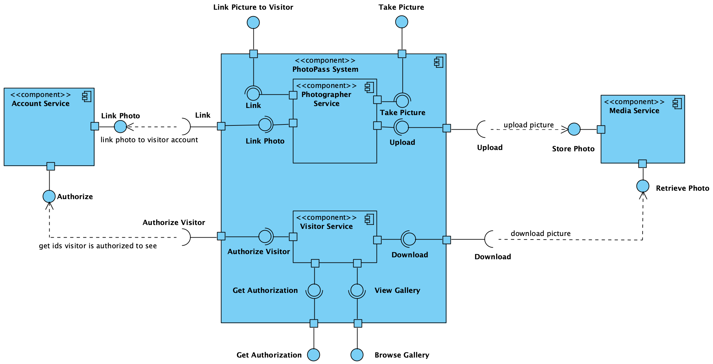

# The Disney PhotoPass System

The PhotoPass system is a photography service offered at Disney theme parks that aims at generating income while maximizing visitors&#39; experience by taking professional pictures of visitors and allowing visitors to purchase their pictures afterward. The system allows visitors to enjoy the theme parks without having to worry about taking pictures themselves. Visitors will encounter photographers as they navigate the parks, and the photographers will take their pictures, which will be associated with the visitors&#39; Disney accounts or temporary guest cards. The PhotoPass system then allows visitors to browse their gallery and purchase pictures at any point during or after their visit.

## Utility Tree

| Quality Attribute | Quality Attribute Refinement | Architecturally Significant Requirement (ASR) | Importance | Difficulty |
| --- | --- | --- | --- | --- |
|
| |
| Performance | Response time | At the busiest hour of the park, a photographer can link a picture to the visitor account in less than 1 second after the picture is taken. | H | H |
|
| |
| At the busiest hour of the park, a photographer can proceed to take the next picture in less than 1 second after the previous picture is linked to visitor&#39;s account. | H | H |
|
| |
| Availability | Down time | The system recovers from crash in less than 1 second by swapping in a hot spare. | H | H |
|
| |
| The system is available for 24/7 web-based account access by visitors. | M | M |
|
| |
| Degradation | The system degrades to storing pictures and their associated account information locally temporarily in the event that either of the account or media service fails. | H | M |
|
| |
| Security | Confidentiality | The system does not allow pictures of one visitor to be accessed by another visitor. | H | M |
|
| |
| Integrity | The system does not authorize visitors to delete their own pictures. | H | M |
|
| |
| Mobility | Operating in a disconnected mode | The system on a _PhotoPass_ camera can store the last 100 pictures locally so that, even if service crashes, no photo is lost. | H | H |
|
| |
| The system on a _PhotoPass_ camera can store the last 100 picture IDs and the associated visitor IDs locally so that, even if service crashes, no photo is left unlinked to the visitors&#39; accounts. | H | L |
|
| |
| Usability | Learning system features | A visitor can easily navigate the system to browse the gallery and select pictures for purchase without having to consult any how-to manual. | M | L |

_Table 1. Utility tree for the PhotoPass system._

**3. UML Diagram of the PhotoPass System (Component Diagram)**

_Figure 1. Component diagram of the PhotoPass system (designed with Visual Paradigm Community Edition)._

## Rationale/Critique of the Architecture

My brief research has led me to conclude that the _PhotoPass_ system interacts with a visitor account service and some sort of media storage and retrieval service. While the focus here is only on the _PhotoPass_ service, the other two services are indispensable to the operations of the _PhotoPass_ system and their existence must be noted: hence their appearance in the component diagram of _figure 1_. I will assess my proposed solution from the point of view of how well it supports the ASRs identified.

## Performance/Response Time

The response time ASRs can be met by making _asynchronous_ the two _Photographer Service_ operations: sending a photo for storage and linking a photo to visitor account. The component diagram in _figure 1_ does not make the assumed asynchrony explicitly visible.

## Availability/No Downtime

Recovery from crash in less than 1 second for the _PhotoPass_ service can be achieved with a 1+1 (hot-spare) redundancy setup, which is not shown in the component diagram of _figure 1_.

## Availability/Degradation

In case either or both of the external services (account service &amp; media service) fails, the circuit breaker pattern can be employed to make sure that pictures and their associated account information are kept locally until the failed service is back up again. The locally stored data will be synced with the external services once the failed service is up. The fallback mechanism is not indicated in the component diagram.

## Confidentiality/Integrity

_Confidentiality_ - the external account service provides authorization for a visitor to download and view only the pictures that belong to the visitor.

_Integrity_ - the media service will allow only a ready-only access to the media files.

## Mobility/Operating in a Disconnected Mode

The _PhotoPass_ cameras can operate in a disconnected mode in the event that the _PhotoPass_ service is unavailable. Cameras can store the last 100 photos and associated account information and sync with the _PhotoPass_ service later on. This ASR is a sort of contingency plan on top of the Availability/No Down Time ASR.

Given memory is very cheap nowadays, this ASR is easily achievable: hence its low (L) difficulty level.

## Usability/Learning System Features

Visitors should not have any difficulty operating the on-site kiosks or the web-app to view their gallery and purchase their pictures. This ASR is easily achievable with state-of-the-art UX design principles and UI design tools.